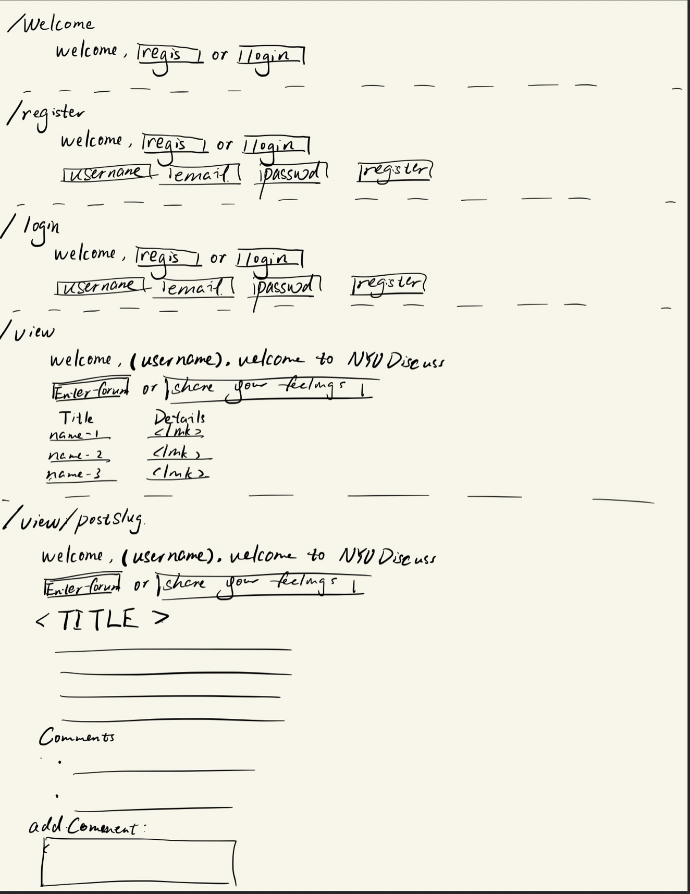
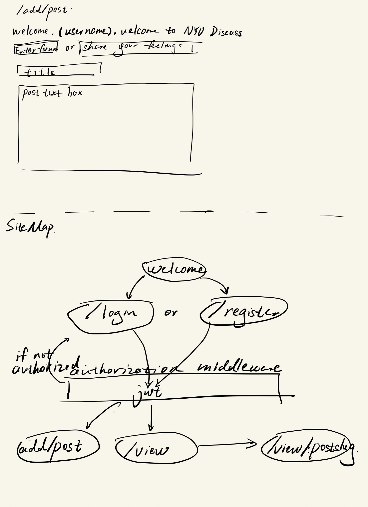
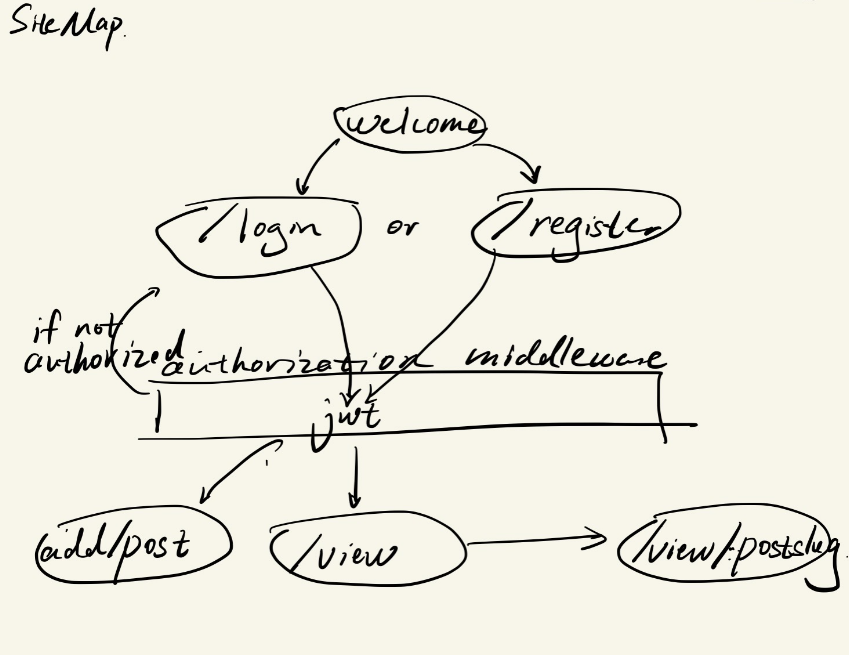

# NYU discuss

## Overview

NYU discuss is a discussion forum for students to share their feelings without being known by another person.

## Data Model

The application will store Users, their posts and comments under one post

- unlogged user can only register or login
- Loginned in user can post
- Loginned user can see other users' posts
- Loginned user can comment under one post

An Example User:

```js
{
  {
    username: {
      type: String,
      required: [true, "Please provide a username"],
      unique: true,
      validate: [validator.isAlpha, "Username must only contain characters"],
    },
    password: {
      type: String,
      required: [true, "Please provide a password"],
      minlength: [8, "password'length should be greater or equal to 8"],
    },
    email: {
      type: String,
      required: [true, "Please provide a email"],
      unique: true,
      validate: [validator.isEmail, "Please provide a valid email"],
    },
    registrationDate: { type: Date, default: Date.now },
  },
  { timestamps: true }
}
```

An Example Post:

```js
{
  user: { type: mongoose.Schema.Types.ObjectId, ref: "User", required: true },
  title: { type: String, required: true, unique: true },
  content: { type: String, required: true },
  // use space in exchange for time, comments stores comment data directly.
  comments: [{ type: String }],
  datePosted: { type: Date, default: Date.now },
  slug: { type: String, unique: true },
},
{ timestamps: true }
```

An Example Comment:

```js
{
  post: { type: mongoose.Schema.Types.ObjectId, ref: "Post", required: true },
  user: { type: mongoose.Schema.Types.ObjectId, ref: "User", required: true },
  content: { type: String, required: true },
  dateCommented: { type: Date, default: Date.now },
},
{ timestamps: true }
```

## [Link to Commented First Draft Schema](db.mjs)

## Sample documents

An example Comment JSON file:

```json
{
  "_id": {
    "$oid": "662191802a48e3c1594ed8a5"
  },
  "post": {
    "$oid": "6619a90c4d1200fd93d64502"
  },
  "user": {
    "$oid": "6619907d7ea0cbc891f406fa"
  },
  "content": "hello!\r\n",
  "dateCommented": {
    "$date": "2024-04-18T21:32:48.210Z"
  },
  "createdAt": {
    "$date": "2024-04-18T21:32:48.213Z"
  },
  "updatedAt": {
    "$date": "2024-04-18T21:32:48.213Z"
  },
  "__v": 0
}
```

An example User JSON file:

```json
{
  "username": "flappyhimself",
  "password": "$2a$12$HWf6.6rC10v12kRQFF/OpOxzmeQdiYI8vMWe4Z38eCxA6z5QqdUjy",
  "email": "sy3535@nyu.edu",
  "registrationDate": {
    "$date": "2024-04-19T16:35:25.059Z"
  },
  "createdAt": {
    "$date": "2024-04-19T16:35:25.062Z"
  },
  "updatedAt": {
    "$date": "2024-04-19T16:35:25.062Z"
  },
  "__v": 0
}
```

An example Post JSON file:

```json
{
  "user": {
    "$oid": "6619907d7ea0cbc891f406fa"
  },
  "title": "Hello World! ",
  "content": "Hello TA!",
  "datePosted": {
    "$date": "2024-04-12T21:35:08.925Z"
  },
  "createdAt": {
    "$date": "2024-04-12T21:35:08.926Z"
  },
  "updatedAt": {
    "$date": "2024-04-18T21:33:05.007Z"
  },
  "slug": "hello-world!",
  "__v": 6,
  "comments": ["hello!\r\n", "gagaga", "that's nice it works!"]
}
```

## Wireframes

/welcome - page for new user

/register - page for registration

/login - page for logining

/view - page for showing posts

/resetPassword/:token - page for resetting your password

/view-recent - page for showing recent posts (within 3 days)

/view-mypost - page for showing only logined in user's posts

/view/:postSlug- page for showing one post and add comment under that post.


/add/post - page for adding post


## Site map



## User Stories or Use Cases

1. As non-registered user, I can register a new account with the site so that I can login
2. As a user, I can log in to the site so that i can see the post.
3. As a user, I can view all other users' posts
4. As a user, I can view my posts & comments
5. As a user, I can view recent posts
6. As a logged in user, I can reset my own password
7. As a user, I can comment on other users' posts

## Research Topics

### validator

- What is it? **ans:** validator -- includes validator in db.mjs to catch validation error.
- Why use it? **ans:** To avoid data pollution and user enter some invalid data that code cannot process.
- List of possible candidate modules or solutions? **ans:** npm "validator" lib. [Validator -- A library of string validators and sanitizers](https://www.npmjs.com/package/validator)
- Points for research topic？**ans:** 2 points since it is a small portion of modification.
- **What I do** -- incorporate lists of sanitizers and validators into db to check error.

### JWT verification

- What is it? **ans:** JWT verification -- one encrption method.
- Why use it? **ans:** Add jwt verification methods instead of session, making the whole verification process stateless.
- List of possible candidate modules or solutions? **ans:** npm "jwtwebtoken" lib. [npm "jwtwebtoken" lib](https://www.npmjs.com/package/jsonwebtoken)[jwt debugger](https://jwt.io/)
- Points for research topic？**ans:** 8 points since it is relatively huge to mangae the routes that needs protection, and storing cookie, send token and decode token ...
- **What I do** --
  - write two functions that create jwt and store jwt cookie in res.cookie
  - add middleware before the routes that needs protedtion and give the user access if he/she has it.

For milestone#3 only:
Show some progress:

- [check JWT](https://github.com/nyu-csci-ua-0467-001-002-spring-2024/final-project-FlappyBob/blob/c4bbb385cc31344c5f951727ca32b4ab23a484f4/auth.mjs#L7)
- [verify JWT](https://github.com/nyu-csci-ua-0467-001-002-spring-2024/final-project-FlappyBob/blob/c4bbb385cc31344c5f951727ca32b4ab23a484f4/auth.mjs#L21)
- [Add JWT verification before the protection routes to ensure correctness](https://github.com/nyu-csci-ua-0467-001-002-spring-2024/final-project-FlappyBob/blob/c4bbb385cc31344c5f951727ca32b4ab23a484f4/routes/userRoutes.mjs#L23)

## [Link to Initial Main Project File](app.mjs)
